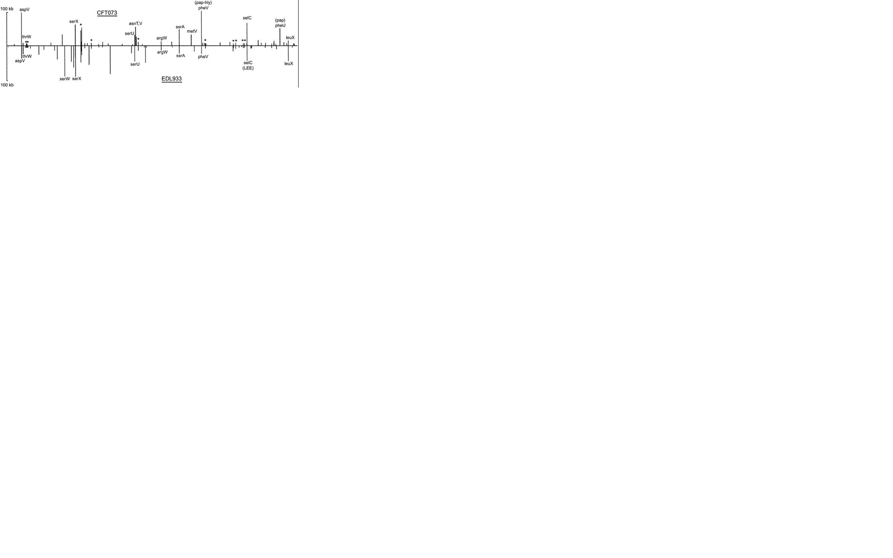

#Module 02 

## Module 02 Origins and Earth Systems: Evidence worksheet_03 The Anthropocene

[Rockstrom et al, 2009](https://www.nature.com/articles/461472a)

#### **Learning Objectives**
* .	Evaluate human impacts on the ecology and biogeochemistry of Earth systems.

#### **General Questions**:

* **What were the main questions being asked?**

What planetary boundaries definee the safe operating space for humanity with respect to the Earth? And which of these boundaries are associated with Earth's biophysical processes?

What are the thresholds for key Earth-system processes? 

Are humans on the verge of crossing these thresholds which could yield unacceptable environmental changes?

* **What were the primary methodlogical approaches used?**

Sediments and ice cores were used to measure greenhouse gas levels of the past to determine the overall trend of climate change

Fossil records, changes in climate, vegetation, and land were used to compare extinction rates over the yeras to study the change in biodiversity

Water samples were used to study the Nitrogen and Phosphorous cycles over time. Additionally, fertilizer was used to study the amount of Nitrogen that was contributed to the atmoshpere by humans. 

* **Summarize the main results or findings**

There are nine processes that have defined planetary boundaries: climate change, rate of biodiversity loss (terrestrial and marine), interference with the nitrogen and phosphorous cycles, stratospheric ozone depletion, ocean acidification, global freshwater use, chang ein land use, chemical pollution, and atmoshperic aerosol loading.

Humanity may soon be approaching the boundaries for global freshwater use, changein land use, ocean acidification and interference with the global phosphorous cycle. Unfortunatley climate change, rate of biodiversity loss and interference with the nitrogen cycle threshold have been violated by humanity

Crossing certain biophysical thresholds could have disastrous consequences for humanity, and all boundaries are tightly connected. As a result, crossing one planetary boundary could have significant effects on another planetary boundary.

Climate change, rate of biodiversity loss, and alterations in the nitrogen cycle will continue to acclerate change in planetary boundaries 

Humans are the main culprit for these occuring changes in the climate due to our ability to disrupt natural biogeochemical cycles (e.g. nitrogen cycle)

The atmospheric CO2 threshold is at 350ppm, however, humans have crossed this threshold as the current atmospheric CO2 concentration is at 387ppm.

No more than 11 million tonnes of phoshorous per year should be allowed to flow into the oceans.

Today, the rate of extinction of species is estimated to be 100 to 1,000 times more than what could be considered natural.

In order to maintain the Holocene, humans must respect the thresholds to these different planetary boundaries in order to protect humanity and maintain a safe world.

* **Do new questions arise from the results?**

What is an appropriate threshold for N2?

How long does it take for humanity to cause dangerous environmental changes or to trigger other feedbacks that drastically reduce the ability of the Earth system, or important subsystems, to return to safe levels?

Since most of the defined boudnaries are tightly coupled, to what extent does exceeding the threshold of one boundary affect another? And what are some quantitative examples of this?

* **Were there any specific challenges or advantages in understanding the paper (e.g. did the authors provide sufficient background information to understand experimental logic, were methods explained adequately, were any specific assumptions made, were conclusions justified based on the evidence, were the figures or tables useful and easy to understand)?**

After reading this paper, something that I noticed was that the authors did not really go into detail with their methodologies. They provided a lot of results without going into detail on how they got them. As well, this paper did not contain many quantitative figures that would have helped the reader understand more of their points. But other than that, I found the paper to be an enjoyable read. They provided good background, and everything was well structured.

## Module 02 Remapping the Body of the World: Evidence worksheet_04 "Bacterial Rhodopsin Gene Expression"

[Martinez et al, 2007](http://www.pnas.org/content/104/13/5590)

#### **Learning Objectives**

* Discuss the relationship between microbial community structure and metabolic diversity
* Evaluate common methods for studying the diversity of microbial communities
* Recognize basic design elements in metagenomic workflows

#### **General Questions**:

* **What were the main questions being asked?**

Can light driven ATP synthesis be transferred to a heterologous bacterium in a single genetic event?

What is the structure and function of PR photosystems

* **What were the primary methodological approaches used?**

PR-containing clones were screened on retinal containing LB agar medium by identifying red/orange pigmentation.

A library of transposon-insertion clones were sequenced to obtain the full DNA sequence of 2 putative PR photosystems containing fosmids.

Cell pigmentation and HPLC pigment analyses were performed to look for the accumulation of intermediates in different transposon insertion mutants to define function.

Ph was measured to determine whether fosmids were independently express a functional PR with light-activated proton-translocating activity

* **Summarize the main results or findings**

2 fosmids that contained the genes necessary for proteorhodopsin based phototrophy were identified. These fosmids were transformed into E. coli. As a result, both exterior pH and interior ATP concentrations changed when the cells were exposed to light

Additionally, these fosmids contained genes that were able to express retinol that was dependent on host-produced intermediate FPP (which E. coli produce)

Fosmid copy number signficaintly impacts phenotypic identification

These clones had high similarity to other PR-containing BAC clones from Alphaproteobacteria from the Mediterranean and Red seas

* **Do new questions arise from the results?**

Are PR-based phototrophy genes usually located on a plasmid, or do they become integrated into the bacterial genome in natural communities?

Is it expected to see this gene set being distributed across many different phyla's?

Are retinal and PR genes typically transferred together?

How much variation is there in this grouping of genes naturally?

* **Were there any specific challenges or advantages in understanding the paper (e.g. did the authors provide sufficient background information to understand experimental logic, were methods explained adequately, were any specific assumptions made, were conclusions justified based on the evidence, were the figures or tables useful and easy to understand)?**

While reading the paper, I initially had issues with understanding what a fosmid is as the authors didn't provide much backgorund on it. Other than that, I found the paper interesting. The accompanying figures really made understanding the material a lot better.

## Module 02 Problem set_03 Metagenomics: Genomic Analysis of Microbial Communities
#### Learning objectives: 
Specific emphasis should be placed on the process used to find the answer. Be as comprehensive as possible e.g. provide URLs for web sources, literature citations, etc.  
*(Reminders for how to format links, etc in RMarkdown are in the RMarkdown Cheat Sheets)*

#### Specific Questions:
* **How many prokaryotic divisions have been described and how many have no cultured representatives (microbial dark matter)?**

By 2016, approximately 89 bacterial phyla and 20 archaeal phyla have been recognized through the 16s rRNA databases. However, it is estimated that up to 1500 bacterial phyla can exist.

Additionally, 26 of the approximately 52 identifiable major phyla within the Bacterial domain have cultivated representatives
.	Thus, 26/52 of the major phyla of Bacteria are uncultured
-	Point is most of the life is uncultured. Only information we have about life is from seqeuncing.

References

[Solden et al, 2016](https://www.sciencedirect.com/science/article/pii/S1369527416300558)
[Youssef et al, 2015](https://www.ncbi.nlm.nih.gov/pmc/articles/PMC4522544)
[Rappé & Giovannoni, 2003](https://www.annualreviews.org/doi/abs/10.1146/annurev.micro.57.030502.090759?rfr_dat=cr_pub%3Dpubmed&url_ver=Z39.88-2003&rfr_id=ori%3Arid%3Acrossref.org&journalCode=micro)

* **How many metagenome sequencing projects are currently available in the public domain and what types of environments are they sourced from?**

From [EBI metagenomics](https://www.ebi.ac.uk/metagenomics/) there are thousands of listed metagenomic projects. The environments that these studies are sourced from include: soil, host-associated humans, host-associated mammals, freshwater, human digestive system, host-associated plant, forest soil, grassland, and marine
  

* **What types of on-line resources are available for warehousing and/or analyzing environmental sequence information (provide names, URLS and applications)?**  

Shotgun metagenomics - [IMG/M genome browsing & annotation platform](https://img.jgi.doe.gov/cgi-bin/m/main.cgi), [MG-RAST, open source web tool that suggests automatic phylogenetic and functional analysis of metagenomes](https://ab.inf.uni-tuebingen.de/software/megan/), [NCBI/EBI](https://www.ncbi.nlm.nih.gov/)

- Assembly fitting annotation pipelines: EULER
-Binning: GCOM-C
-Annotation: KEGG
-Analysis pipeline: MEGAN5

Marker gene metagenomics

-Standalone software: OTU base
-Analsysis pipeline: SILVA (goldstandard for 16s)
-Denoising: Ampliconnoise
-Databases: Ribosomal database project (RDP)

Microgene metagenomics

Review Articles

* **What is the difference between phylogenetic and functional gene anchors and how can they be used in metagenome analysis?**   

Phylogenetic gene anchors:

-veritcal gene transfer
-carry phylogenetic info
-taxonomic
-ideally single copy

Functional gene anchors:
-more horizontal gene transfer
-identify specific biogeochemical functions associated with measureable effects
-not as useful for phylogentic construction

* **What is metagenomic sequence binning? What types of algorithmic approaches are used to produce sequence bins? What are some risks and opportunities associated with using sequence bins for metabolic reconstruction of uncultivated microorganisms?**  

Binning is the process of grouping sequences or sequence reads that come from a single genome. There are different algorithms that can take part in this process. If we have a database with pre-existing genomes of similar organisms, we can map the sequences onto the genome and gruop them according to which genome they map to or group according to quality (%GC, codons, etc.)

Type of algorithms include: Aligning sequences to database, grouping to each other based on DNA characteristics (%GC, codon usage)

The main issues for filling bins include incomplete coverage of genome sequences. As a result, you'll be left with a non-representative genome. You can also have contamination if the genome from antoher organism has similar enough properties (putting in non-belonging genes into the genome). The current threshold for contamination is approximately 5-10%

* **Is there an alternative to metagenomic shotgun sequencing that can be used to access the metabolic potential of uncultivated microorganisms? What are some risks and opportunities associated with this alternative?**

Functional screens (biochemical assays/screen)

Single cell sequencing- provides a higher resolution for cellular differences and better understanding of the function of an individual cell. Less contamination.

3rd generation sequencing (oxford nanopore)-

FISH (imaging technique using probe that binds to specific sequence in the cell)- Can help define the spatial-temporal patterns of gene expression within cells and tissues.

#Module 03 

## Module 03 Microbial Species Concepts: Evidence worksheet_05 "Extensive mosaic structure"

[Welch et al, 2002](Extensive mosaic structure revealed by the completegenome sequence of uropathogenic Escherichia coli)

#### **Part 1 Learning Objectives**
*Evaluate the concept of microbial species based on environmental surveys and cultivation studies
*Explain the relationship between microdiversity, genomic diversity and metabolic potential
*Comment on the forces mediating divergence and cohesion in natural microbial communities

#### **General Questions**:
* **What were the main questions being asked?**

How do the 3 different E.coli strains (CFT073, EDL933, and MG1655) differ from each other in terms of genome composition? How do these differences reflect on their pathogenicity in intestinal diseases?

How does lateral gene transfer contribute to the emergence of new uropathogenic E. coli strains and the characteristic of lifestyle and disease-causing traits?

* **What were the primary methodological approaches used?**

Clones and sequencing:

The sequencing data was assembled by SEQMANII and the genome sequence was anotated using MAGPIE. GLIMMER was used to define the ORFs

The nr/nt database from BLAST was used to explore potential protein sequences

Used a 90% identity match of CFT073 in either MG1655 or EDL933, where alignments included at least 90% of both genes, and lack of equivalent match in other locations in CFT073 genome was used to infer orthology.

* **Summarize the main results or findings**

Through lateral gene transfer, new genes arise in the genome of E. coli leading to distinct lineages. As a result, the backbone itself is evolutionarily conserved through vertical gene trasnfer while the differences between species stem from the different pathogenicity islands. E.coli differentiate into distinct ilneages due to lateral gene transfer.

Comparison of hte CFT073, EDL933 and MG1655 strains reveals that only 39.2% of their combined set of proteins are common to each other. CFT073 isrich in genes that encode fimbrial adhesins, autotransporters, iron-sequestration systems, and phase-swtich recombinases. There are large differences between the pathogenicity islands of CFT073 and 2 other uropathogenic E.coli strains J96 and 536.

The pathogenicity island genes acquired form lateral gene transfer provided the E.coli with the virulence tools to infect the urinary tract and bloodstream. Also these islands provided the E.coli with an evasion mechanism against host defense systems without compromising its ability to harmlessly colonize the intestine

The acquired genes were able to promote the colonziation of the different regions of the intestine during an ascending urinary tract infectiona nd cause distinct pathologies depending on the site of colonization.

Specific regions in the genome for insertion of the pathogenic islands are conserved. There is great diversity between PAIs of pathogenic/unpathogenic strains.

* **Do new questions arise from the results?**

Lateral gene transfer makes it hard to define what a species. As we can see from these 3 E.coli strains with a 39.2% similarity, how can we better define speices given sucha  fine line separation of the different strains?

How can we relate these genomic differences of these E.coli strains to the location they inhabit in the human body?

* **Were there any specific challenges or advantages in understanding the paper (e.g. did the authors provide sufficient background information to understand experimental logic, were methods explained adequately, were any specific assumptions made, were conclusions justified based on the evidence, were the figures or tables useful and easy to understand)?**

Something that I noticed while reading the paper was that the authors already assume that you have a solid foundation in E.coli genomics. As a result, it may be required to read other materials detailing the foundations of E.coli genomics prior to reading this paper. Additionally, there aren't many figures of their results. This makes it a bit more difficult to understand their interpretations.

#### **Part 2 Learning Objectives**

* Comment on the creative tension between gene loss, duplication, and acquisition as it relates to microbial genome evolution
* Identify common molecular signatures used to infer genomic identity and cohesion
* Differentiate between mobile elements and different modes of gene transfer

**Based on your reading and discussion notes, explain the meaning and content of the following figure derived from the comparative genomic analysis of three E. coli genomes by Welch et al. Remember that CFT073 is a uropathogenic strain and that EDL933 is an enterohemorrhagic strain. Explain how this study relates to your understanding of ecotype diversity. Provide a definition of ecotype in the context of the human body. Explain why certain subsets of genes in CFT073 provide adaptive traits under your ecological model and speculate on their mode of vertical descent or gene transfer.**

The figure above is a depiction of the pathogenicity islands present in both E.coli strains CFT073 and EDL933. The location of the islands are on the horizontal axis while the size (kb) is on the vertical axis. Many of the islands are localized at the same backbone position between the two strains, however the contents of the islands' themselves are unrelated. 

From my understanding, an ecotype is a distinct species that occupies a specific habitat. But after reading this study, ecotype in the context of the human body could also be defined based on an organism's niche in the human microbiota and even their genetic composition. It is important to note that distinct ecotypes can share a common genomic backbone but differ in terms of genomic islands found within the backbone that have been acquired through lateral gene transfer across species. 

Additionally, organisms localized in different areas of the human body are exposed to different environmental stimuli and host factors. As a result, the selectional pressures may vary depending on the site of localization and thus will have specific genes selected for. This is likely why CFT073 is able to retain its acquired pathogenicity islands as they are required for it to be able to adapt to its environment. Furthermore, it is likely that the genomic backbone of CFT073 is acquired from vertical descent. In contrast, it is the pathogenicity islands that have been acquired through horizontal gene transfer from other bacterial species. It is these island that encode specific genes that help promote the survival of CFT073 in its environment. Therefore the acquisition of these islands are paramount for the propagation of CFT073.

